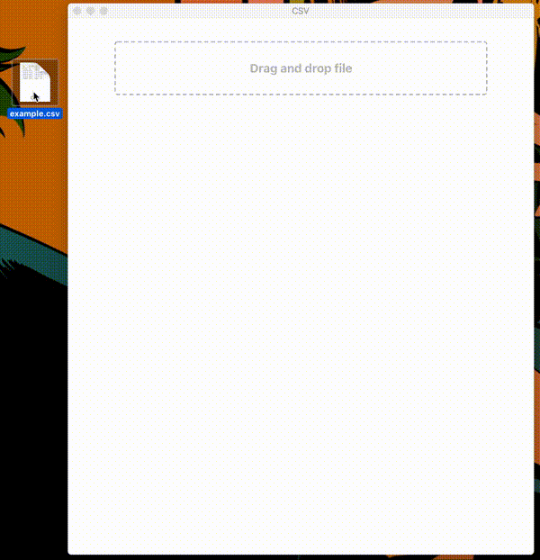

# csv-select

```
% git clone https://github.com/abetomo/csv-select.git
% cd csv-select
% npm i
% npm run dev
```

# Demo

```csv:sample.csv
date,impressions,clicks,conversions
2018/9/14,37.00,35.00,2.00
2018/9/14,674.00,308.00,10.00
2018/9/15,4502.00,1141.00,28.00
2018/9/15,6667.00,1964.00,36.00
2018/9/15,6550.00,2441.00,44.00
2018/9/15,2219.00,828.00,16.00
```


